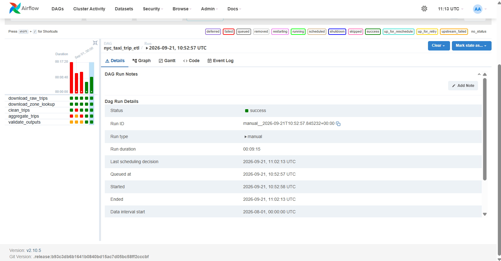

# NYC Taxi ETL PySpark Pipeline

A **batch ETL pipeline** that ingests the free [NYC TLC Trip Record Data](https://www.nyc.gov/site/tlc/about/tlc-trip-record-data.page)
(yellow / green / FHV taxi trip Parquet files), cleans and enriches them with **PySpark**, joins them
against the NYC **taxi zone lookup** table, writes **date- and borough-partitioned Parquet** outputs,
and orchestrates the whole flow with **Apache Airflow** — all running **locally in Docker**.
No API keys, no rate limits, no paid cloud services.

> Designed to be run on a laptop and reasoned about in interviews: the same Spark code
> ports to GCP Dataproc / AWS EMR with configuration-only changes (see [§6](#6-porting-to-a-real-cluster-dataproc--emr)).

---

## 1. What it does

| Stage | Tool | What happens |
|-------|------|--------------|
| **Ingest** | `scripts/ingest.py` | HTTP GET of the raw TLC Parquet file(s) for 1+ months into `data/raw/`; also downloads the taxi zone lookup CSV into `data/dimensions/` (bundled fallback included). |
| **Clean** | `spark/jobs/taxi_etl.py --stage clean` | Reads Parquet → Spark DataFrame, canonicalizes schema, drops nulls/invalid rows, dedupes, derives `trip_duration_minutes`, `avg_speed_mph`, `fare_per_mile`, writes `data/processed/cleaned/` partitioned by `trip_date`. |
| **Transform** | `spark/jobs/taxi_etl.py --stage aggregate` | Joins `PULocationID → Borough / Zone / service_zone`, builds daily + hourly **pickup-zone aggregations** (rides, passengers, revenue, tips, distance, avg duration/speed, fare-per-mile), writes partitioned Parquet. |
| **Orchestrate** | `dags/taxi_trips_etl_dag.py` | 5 Airflow tasks with clear dependencies, 2 retries + exponential backoff, and log-per-task in the UI. |
| **QA** | `validate_outputs` task | Reads the aggregates back with Spark, asserts every table is non-empty (`FATAL` + task failure otherwise). |

**Cleaning rules** (each decision is logged with row counts): critical-column nulls,
`fare_amount <= 0`, `trip_distance <= 0`, `passenger_count < 1`, durations `< 1 min` or `> 24 h`,
average speed `> 120 mph`, and exact duplicate trips.

## 2. Architecture

```
  ┌──────────────┐  HTTP GET (no auth)   ┌──────────────────────────────────────────────┐
  │  NYC TLC     ├──────────────────────►│         docker compose  (all local)          │
  │  trip-record │  trip_data .parquet   │                                              │
  │  page / S3   │                       │   ┌───────────┐   ┌──────────────────────┐   │
  │  cloudfront  │                       │   │ postgres  │   │ redis               │   │
  │  bucket      │                       │   │ (Airflow  │   │ (Airflow scheduler  │   │
  └──────────────┘                       │   │  metadata)│   │  queue/health)      │   │
       │                                │   └───────────┘   └──────────────────────┘   │
       ▼  taxi_zone_lookup.csv           │         ▲                      ▲             │
  ┌──────────────┐                      │         └──────────┬───────────┘             │
  │  zone lookup │  (bundled fallback   │         ┌─────┬────▼────────────────┐        │
  └──────────────┘   in repo)           │         │             Airflow       │        │
                                        │         │   webserver :8080         │        │
                                        │         │   scheduler               │        │
                                        │         │   ┌─────────────────────┐ │        │
                                        │         │   │  tasks (5)          │ │        │
  volumes (./data)                      │  reads/  │   │ 1 download_raw      │ │        │
  ──────────────────────                │  writes  │   │ 2 download_zone     │ │        │
  data/raw        *.parquet   ◄──────────┤ (they're─┤ 3 clean_trips         │ │        │
  data/dimensions lookup.csv  ▲──────────┤  the     │ 4 aggregate_trips     │ │        │
  data/processed  cleaned/    │          │  same    │ 5 validate_outputs    │ │        │
                  aggregations│          │  layout) │   └────────┬──────────┘ │        │
  (date + borough partitions) └──────────┤           └───────────┼─────────────┘        │
                                        │            PySpark runs local[*] (JVM inside │
                                        │            the Airflow image, no cluster)     │
   UI: http://localhost:8080             └──────────────────────────────────────────────┘
   user/pass: airflow / airflow
```

Key idea: the **scheduler container bundles a JVM + PySpark** (`airflow/Dockerfile`), so Spark
runs in `local[*]` mode *inside* the container and every task's stdout is captured by Airflow
and shown in the UI Logs tab — no separate cluster, SSH, or Spark master URL juggling.

## 3. Repository layout

```
├── docker-compose.yml        # Airflow webserver+scheduler, postgres, redis, init
├── .env.example              # copy to .env: UID, dataset, months, Spark memory
├── .gitignore
├── airflow/
│   └── Dockerfile            # apache/airflow + OpenJDK 17 + PySpark/PyArrow
├── requirements.txt          # pyspark==3.5.5, pyarrow
├── dags/
│   └── taxi_trips_etl_dag.py # the 5-task ETL DAG (retries, XCom, doc_md)
├── scripts/
│   └── ingest.py             # HTTP downloader (trips + zone lookup), retries
├── spark/
│   ├── data/taxi_zone_lookup.csv   # committed fallback (265 zones)
│   └── jobs/taxi_etl.py            # the PySpark job (clean / aggregate / all)
├── screenshots/
│   └── airflow-dashboard.png       # the DAG graph view (live run) — see §7
└── data/                     # generated at runtime (git-ignored)
    ├── raw/                  #   raw TLC parquet + _manifest.json
    ├── dimensions/           #   taxi_zone_lookup.csv (downloaded)
    └── processed/            #   cleaned/  aggregations/{daily,hourly}/
```

## 4. Prerequisites

- **Docker Desktop** (with the bundled **Docker Compose v2**) — verify: `docker compose version`
- ~6 GB free disk for the Airflow image + 1–2 months of trip data
- 8 GB RAM recommended (Spark driver defaults to 2 GB; see `SPARK_DRIVER_MEMORY`)

Nothing else is installed on your host — Java, Python, Airflow and Spark all live in the containers.

## 5. Setup & run

```powershell
# 1) configure (keep defaults for a first run: yellow, 2025-01)
Copy-Item .env.example .env

# 2) build the image (installs Airflow + OpenJDK + PySpark; slow first time)
docker compose build

# 3) one-off: create DB schema + admin user (airflow / airflow)
docker compose up airflow-init

# 4) bring the stack up
docker compose up -d

# 5) confirm healthy
docker compose ps
```

Open **http://localhost:8080** and log in with `airflow` / `airflow`.

### Trigger the DAG

1. In the Airflow UI go to **DAGs** → open **`nyc_taxi_trip_etl`**.
2. **Play ▸ Trigger DAG** (or the "Trigger DAG w/ config" to just watch). The graph shows
   `download_raw_trips → download_zone_lookup → clean_trips → aggregate_trips → validate_outputs`.
3. Click a running/failed task → **Log** to stream its logging live: you will see download bytes,
   Spark row counts at every cleaning stage, join + aggregate counts, and the output paths.

A typical run ingests ~80 MB of Parquet (~2.4 M yellow rows) and completes in a few minutes
(first run is slower: Spark JAR warm-up).

### Change the dataset or months

Edit `.env`, then reload the containers so the DAG re-parses with the new environment:

```powershell
# e.g. two months of green taxi
#   TAXI_DATASET=green
#   TAXI_MONTHS=2025-01,2025-02
docker compose up -d        # scheduler + webserver pick up the new env
```

To **re-run** with a fresh output, either delete the partitions first or wipe the
processed tree:

```powershell
Remove-Item data\processed -Recurse -Force
```

### Inspect the outputs

The tables are Parquet (partitioned by `trip_date` and, for aggregates, `Borough`):

```
data/processed/cleaned/yellow/trip_date=2025-01-01/...
data/processed/aggregations/daily_pickup_zone_metrics/trip_date=2025-01-01/Borough=Manhattan/...
data/processed/aggregations/hourly_pickup_ride_counts/trip_date=2025-01-01/Borough=Queens/...
```

Drop into a container to poke around (or read them from any Spark/pandas+pyarrow session):

```powershell
docker compose exec scheduler python -c "import pyspark; s=pyspark.sql.SparkSession.builder.master('local[1]').appName('inspect').getOrCreate(); s.read.parquet('data/processed/aggregations/daily_pickup_zone_metrics').show(10, truncate=50)"
```

## 6. Porting to a real cluster (Dataproc / EMR)

The whole point of this project is that *nothing about the compute is special* — the ETL is
plain PySpark that already writes partitioned Parquet. Porting means **config**, not code rewrites.

| Concern | This repo (local) | Dataproc / EMR |
|---------|-------------------|----------------|
| **Spark session** | `master("local[*]")` hard-coded | Drop the `master("local[*]")` → `getOrCreate()` connects to YARN/Kubernetes automatically. `taxi_etl.py` already honors `SPARK_MASTER_URL`, so on the cluster you simply **don't set it** (or set `yarn`). |
| **Storage** | `--data-root data/` (POSIX bind mount) | Same script, point `--data-root` at `gs://my-bucket/tlc` or `s3://my-bucket/tlc`. Spark reads/writes Parquet natively from object storage; the **`trip_date` / `Borough` partition scheme carries over unchanged**, so partition pruning keeps processing cheap as volume grows to 100s of millions of rows. |
| **Orchestration** | BashOperator runs `python taxi_etl.py` inside the scheduler | Same DAG shape, but: **Dataproc**: `DataprocCreateClusterOperator → DataprocSubmitJobOperator` (submit the identical job); or **EMR**: `EmrCreateJobFlowOperator → EmrAddStepsOperator`. Cheapest: run the *same* script as **Dataproc Serverless**/ **EMR Serverless**, with Airflow only waiting on completion — no long-lived cluster to pay for. |
| **Ingestion** | Containers read the TLC cloudfront URL directly | Keep the HTTP pull as-is, or stage TLC files once to GCS/S3 (partitioned by month) and have Airflow's `ingest` task only check for new months with `S3KeySensor`/`GCSObjectExistenceSensor`. |
| **Data dimensions** | Zone lookup CSV downloaded / bundled | Load the 265-row CSV once into a persistent table (e.g. BigQuery / Glue Data Catalog) or ship it in the job's dependency JAR/zip. |
| **Scaling knobs** | `spark.driver.memory=2g`, `shuffle.partitions=8` | Raise to cluster-aware values (`spark.executor.memory`, `spark.sql.shuffle.partitions` ≈ `executors × cores`). Set via the Airflow/Spark operators instead of env vars. |
| **Scheduling** | `@monthly` manual trigger | Same `@monthly` (or `30 3 * * *`), and now the Airflow server can live on a VM/free-tier and drive the cloud jobs. |

**Interview-ready summary:** "The code runs on any Spark — locally I use `local[*]`; on Dataproc/EMR
`SparkSession.builder.getOrCreate()` binds to the cluster. Storage moves from a bind mount to a
GCS/S3 bucket, the Parquet partitioning and PySpark logic don't change, and the Airflow DAG
swaps its BashOperators for cluster-creation + job-submission operators (or Serverless batch).
The only hard part in production is data-volume engineering, not the ETL shape."

## 7. Sample data (real output, 50,000-row subset)

Captured by actually running this pipeline against `yellow_tripdata_2025-01.parquet` (smoke
test limited to the first 50,000 rows, so every pickup above falls on **2025-01-01**).

**Before — two rows as shipped by TLC (raw Parquet):**

```
VendorID | tpep_pickup_datetime | tpep_dropoff_datetime | passenger_count | trip_distance | fare_amount | PULocationID | DOLocationID | total_amount
1        | 2025-01-01 00:18:38  | 2025-01-01 00:26:59   | 1               | 1.6           | 10.0        |  229          |  237          | 18.0
1        | 2025-01-01 00:32:40  | 2025-01-01 00:35:13   | 1               | 0.5           | 5.1         |  236          |  237          | 12.12
```

**After — cleaned trips (random rows; duration / speed / fare-per-mile derived, invalid rows gone):**

```
pickup_datetime      | dropoff_datetime       | pass | distance | fare | service | duration_min | speed_mph | fare/mile | revenue | trip_date   | hour
2025-01-01 14:36:24  | 2025-01-01 15:01:46   | 4    | 11.79    | 46.4 | yellow  | 25.37        | 27.89     | 3.94      | 71.05   | 2025-01-01  | 14
2025-01-01 00:21:03  | 2025-01-01 00:48:55   | 4    | 1.33     | 22.6 | yellow  | 27.87        | 2.86      | 16.99     | 27.6    | 2025-01-01  | 0
2025-01-01 02:12:28  | 2025-01-01 02:23:40   | 1    | 2.03     | 12.8 | yellow  | 11.20        | 10.88     | 6.31      | 21.36   | 2025-01-01  | 2
```

**After — `daily_pickup_zone_metrics` (top 5 zones by trips; joined to borough/zone names):**

```
trip_date   | Borough   | PULocationID | Zone          | total_trips | total_passengers | total_distance_miles | total_fare_revenue | total_tips | avg_duration_min | avg_speed_mph | avg_fare_per_mile
2025-01-01  | Queens    | 132          | JFK Airport   | 2250        | 3805             | 34789.12             | 172140.88          | 18173.58   | 30.93            | 31.44         | 5.05
2025-01-01  | Manhattan | 79           | East Village  | 1980        | 3018             | 5069.69              | 45345.05           | 5783.08    | 12.98            | 11.85         | 7.27
2025-01-01  | Manhattan | 161          | Midtown Center| 1910        | 3146             | 5883.57              | 50415.89           | 5529.56    | 15.45            | 11.06         | 8.88
2025-01-01  | Manhattan | 48           | Clinton East  | 1704        | 2640             | 6142.02              | 49084.25           | 5561.27    | 15.31            | 12.7          | 8.0
2025-01-01  | Manhattan | 68           | East Chelsea  | 1621        | 2589             | 4939.46              | 42995.26           | 4991.11    | 17.95            | 10.93         | 8.74
```

**After — `hourly_pickup_ride_counts` (top 5 by ride_count):**

```
trip_date   | Borough   | PULocationID | Zone                | trip_hour | ride_count
2025-01-01  | Manhattan | 79           | East Village        | 2         | 380
2025-01-01  | Manhattan | 79           | East Village        | 1         | 341
2025-01-01  | Manhattan | 79           | East Village        | 3         | 336
2025-01-01  | Manhattan | 142          | Lincoln Square East | 0         | 313
2025-01-01  | Queens    | 132          | JFK Airport         | 15        | 312
```

New Year's Day makes perfect sense in the data: the top pickup zones at 2 a.m. are nightlife
neighborhoods, and JFK Airport carries the day's airport traffic.

**In the Airflow UI**, green task instances + the **Details** tab per task give you the live
picture: the DAG graph, run durations, and each task's **Log** stream showing download byte
counts and Spark row counts at every cleaning stage.



*The `nyc_taxi_trip_etl` DAG in the Airflow **Graph** view after a successful manual run
(**Status: success**): the status legend, all five tasks green in dependency order
`download_raw_trips → download_zone_lookup → clean_trips → aggregate_trips → validate_outputs`,
and the Run Details panel — manual run, 9m 15s duration, data interval Aug 2025–Sep 2025.*

## 8. Troubleshooting

| Symptom | Fix |
|---------|-----|
| First `docker compose up -d` slow / "pull timeout" | `docker compose build` first (image was already built); retry. |
| Port 8080 in use | set `AIRFLOW_WEB_SERVER_PORT=8081` in `.env`, reopen http://localhost:8081. |
| Task fails "FATAL: input path does not exist" | `download_*` failure — check its Log; likely network/proxy. Rerun failed tasks (▶ Retry). |
| JVM OOM during clean/aggregate | raise `SPARK_DRIVER_MEMORY=4g` in `.env` → `docker compose up -d`. |
| DAG not visible in UI | give scheduler ~30 s (`dag_dir_list_interval`), then refresh; check `docker compose logs scheduler`. |
| Wrong month processed | it reads `.env` at scheduler start — edit `.env`, `docker compose up -d`. |
| Zone lookup download 403/404 one day | the bundled `spark/data/taxi_zone_lookup.csv` fallback kicks in automatically. |
| Nuke everything and restart | `docker compose down -v` then **3)**–**4)** again (deletes postgres volume + re-migrates). |
| Windows UID / permission errors on mounts | keep `AIRFLOW_UID=50000` in `.env` (official Windows guidance). |
| Spark "Unable to clear output directory …/processed/…" | the folder was created as a different uid (e.g. a throwaway root container). Delete `data/processed` on the host (`Remove-Item -Recurse -Force data\processed`) and rerun — the Airflow container (uid 50000) recreates it. |
| Want raw ~ data to persist between runs | it does — `data/` is a bind mount; delete only what you want to reprocess. |

## 9. Common gotchas & design notes

- `coalesce(1)` before partitioned writes keeps `data/processed` small and human-readable for a
  laptop demo; on a cluster you'd remove it (more, parallel files).
- `ingest.py` and `taxi_etl.py` both **print the artifact path as the final stdout line**; the DAG
  uses `do_xcom_push=True` so downstream tasks receive exact paths through XCom — a good pattern
  to reference in interviews.
- FHV (`fhvhv`) trips have no `passenger_count`; the canonicalizer substitutes a null that the
  passenger filter skips, and revenue maps to `base_passenger_fare`.
- Everything runs in `local[*]` (all container cores); `SPARK_MASTER_URL` can be overridden to
  `spark://host:7077` to point at a standalone Spark container without code changes.

## License & data

Pipeline code is MIT-licensed (see LICENSE) — trip data remains property of the NYC Taxi & Limousine
Commission and is used under their [data usage terms](https://www.nyc.gov/site/tlc/about/tlc-trip-record-data.page).